# Application Sitemap & User Journey - IoT Monitoring System V3

## Complete Application Sitemap

```mermaid
graph TD
    Root["/"] --> CheckAuth{Authenticated?}
    CheckAuth -->|No| Login[Login Page]
    CheckAuth -->|Yes| Dashboard[IoT Status]

    Login --> LoginForm[POST /login]
    LoginForm --> Dashboard

    Login --> RegisterLink[Register Link]
    RegisterLink --> Register[Register Page]
    Register --> RegisterForm[POST /register]
    RegisterForm --> Dashboard

    Dashboard --> IoTStatus[IoT Status]
    Dashboard --> Devices[Devices]
    Dashboard --> Camera[Live Camera]
    Dashboard --> Notifications[Notifications]
    Dashboard --> History[Historical Data]
    Dashboard --> CheckAdmin{Is Admin?}

    CheckAdmin -->|Yes| AdminUsers[Manage Users]
    CheckAdmin -->|Yes| AdminDevices[Manage Devices]

    IoTStatus --> SensorData[Real-time Sensor Data]
    IoTStatus --> ActuatorControl[Actuator Control]
    IoTStatus --> DeviceStatus[Device Status]

    Devices --> DeviceList[Device List]
    DeviceList --> AddDevice[Add Device]
    DeviceList --> EditDevice[Edit Device]
    DeviceList --> DeleteDevice[Delete Device]
    DeviceList --> DeviceThresholds[Configure Thresholds]

    Camera --> LiveStream[Live Video Stream]
    Camera --> CameraGallery[Image Gallery]
    LiveStream --> CaptureImage[Capture Image]
    LiveStream --> StreamControl[Start/Stop Stream]
    LiveStream --> FlashControl[Flash Control]
    LiveStream --> QualitySettings[Quality Settings]

    Notifications --> TelegramSettings[Telegram Config]
    Notifications --> FCMSettings[Firebase FCM Config]
    Notifications --> ThresholdConfig[Sensor Thresholds]
    Notifications --> NotifLogs[Notification Logs]
    Notifications --> TestNotif[Send Test]

    History --> SensorHistory[Sensor Data Charts]
    History --> ActuatorHistory[Actuator History Charts]
    History --> FilterData[Date/Device Filter]
    History --> ExportData[Export Data]

    AdminUsers --> UserList[List All Users]
    UserList --> CreateUser[Create User]
    UserList --> EditUser[Edit User]
    UserList --> ViewUser[View User Details]
    UserList --> DeleteUser[Delete User]

    AdminDevices --> AllDeviceList[List All Devices]
    AllDeviceList --> CreateAdminDevice[Create Device]
    AllDeviceList --> EditAdminDevice[Edit Device]
    AllDeviceList --> ViewAdminDevice[View Device Details]
    AllDeviceList --> DeleteAdminDevice[Delete Device]
    AllDeviceList --> AssignDevice[Assign to User]

    Dashboard --> Logout[Logout]
    Logout --> Login

    style Dashboard fill:#4f46e5,stroke:#312e81,stroke-width:3px,color:#fff
    style AdminUsers fill:#dc2626,stroke:#991b1b,stroke-width:2px,color:#fff
    style AdminDevices fill:#dc2626,stroke:#991b1b,stroke-width:2px,color:#fff
    style Login fill:#059669,stroke:#065f46,stroke-width:2px,color:#fff
```

## User Journey Flows

### 1. Regular User Journey

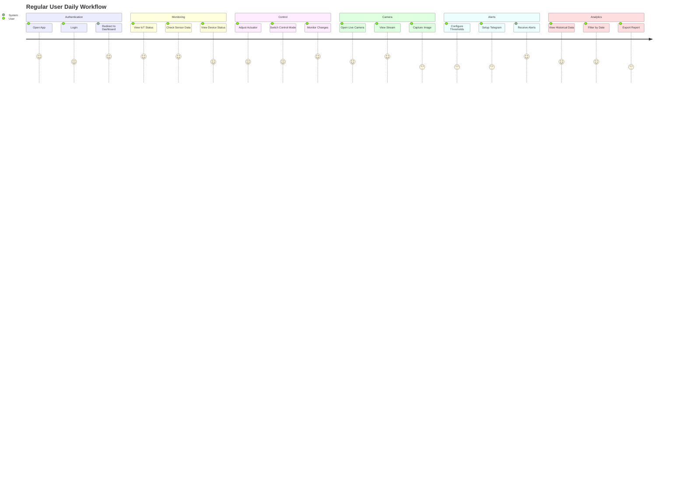

### 2. Admin Journey

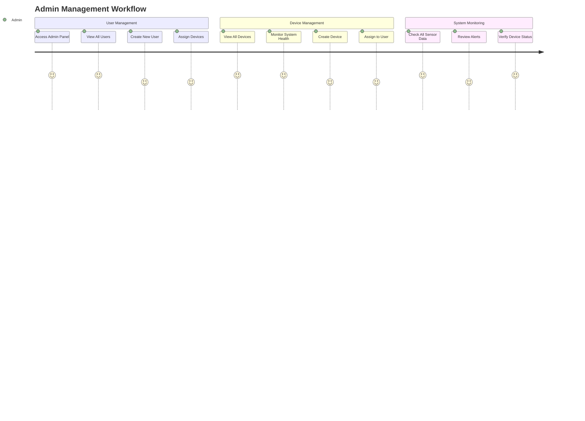

### 3. First-Time User Onboarding Journey

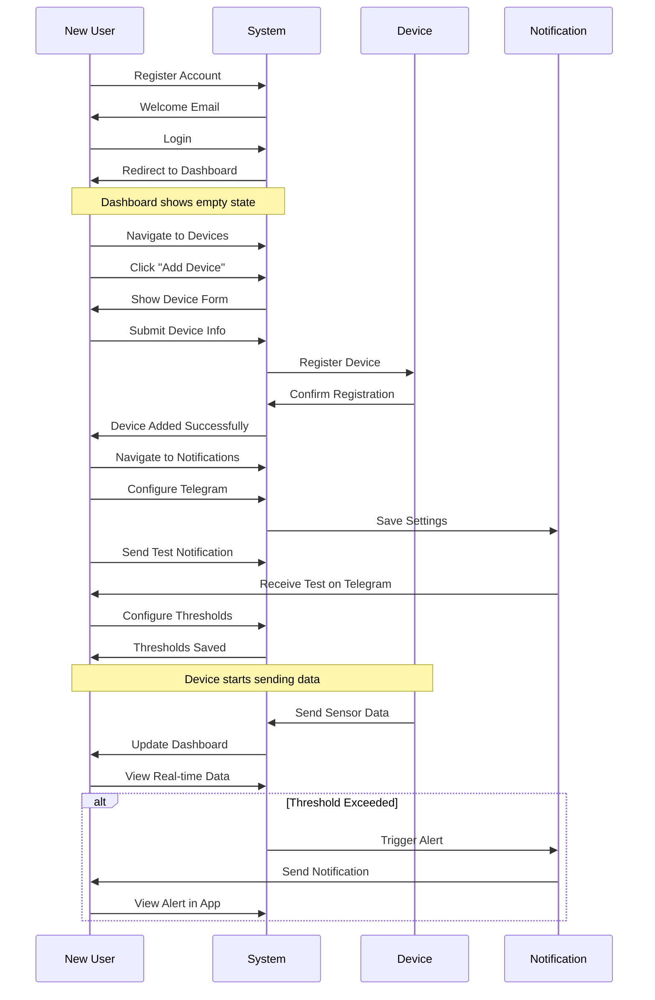

## Page Hierarchy & Navigation

### Complete Page Tree

```
Application Root (/)
│
├── 🔓 Guest Pages
│   ├── Login (/login)
│   │   └── POST Login Form
│   └── Register (/register)
│       └── POST Register Form
│
├── 🔐 Authenticated Pages
│   │
│   ├── 📊 Main Dashboard
│   │   └── IoT Status (/iot/status) [DEFAULT]
│   │       ├── Sensor Data Cards
│   │       ├── Real-time Charts
│   │       └── Actuator Controls
│   │
│   ├── 📱 Devices (/devices)
│   │   ├── Device List View
│   │   ├── Add Device Modal
│   │   ├── Edit Device Modal
│   │   └── Threshold Configuration
│   │       └── (/devices/{id}/thresholds)
│   │
│   ├── 📹 Camera (/camera)
│   │   ├── Live Stream (/camera/live)
│   │   │   ├── Video Feed
│   │   │   ├── Camera Controls
│   │   │   └── Capture Button
│   │   └── Gallery (/camera/{deviceId}/gallery)
│   │       └── Image Grid View
│   │
│   ├── 🔔 Notifications (/notifications)
│   │   ├── Settings Tab
│   │   │   ├── Telegram Config
│   │   │   ├── FCM Config
│   │   │   └── Test Notification
│   │   ├── Thresholds Tab
│   │   │   └── Per-device Sensor Thresholds
│   │   └── Logs Tab
│   │       └── Notification History
│   │
│   ├── 📊 Historical Data (/history)
│   │   ├── Sensor Charts Tab
│   │   │   ├── Temperature Chart
│   │   │   ├── Humidity Chart
│   │   │   ├── Air Quality Chart
│   │   │   ├── Water Level Chart
│   │   │   ├── Soil Moisture Chart
│   │   │   └── Weight Chart
│   │   ├── Actuator Charts Tab
│   │   │   ├── Fan Duty Chart
│   │   │   ├── Heater Duty Chart
│   │   │   └── Humidifier Duty Chart
│   │   └── Filters Panel
│   │       ├── Date Range
│   │       ├── Device Selector
│   │       └── Export Button
│   │
│   └── 🔐 Admin Pages (/admin)
│       │
│       ├── 👥 Manage Users (/admin/users)
│       │   ├── User List (/admin/users)
│       │   ├── Create User (/admin/users/create)
│       │   ├── Edit User (/admin/users/{id}/edit)
│       │   ├── View User (/admin/users/{id})
│       │   └── Delete User (DELETE /admin/users/{id})
│       │
│       └── 🔧 Manage Devices (/admin/devices)
│           ├── Device List (/admin/devices)
│           ├── Create Device (/admin/devices/create)
│           ├── Edit Device (/admin/devices/{id}/edit)
│           ├── View Device (/admin/devices/{id})
│           └── Delete Device (DELETE /admin/devices/{id})
```

## User Flow Diagrams

### IoT Monitoring Flow

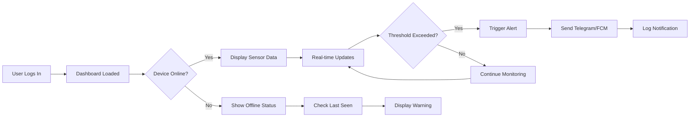

### Device Control Flow

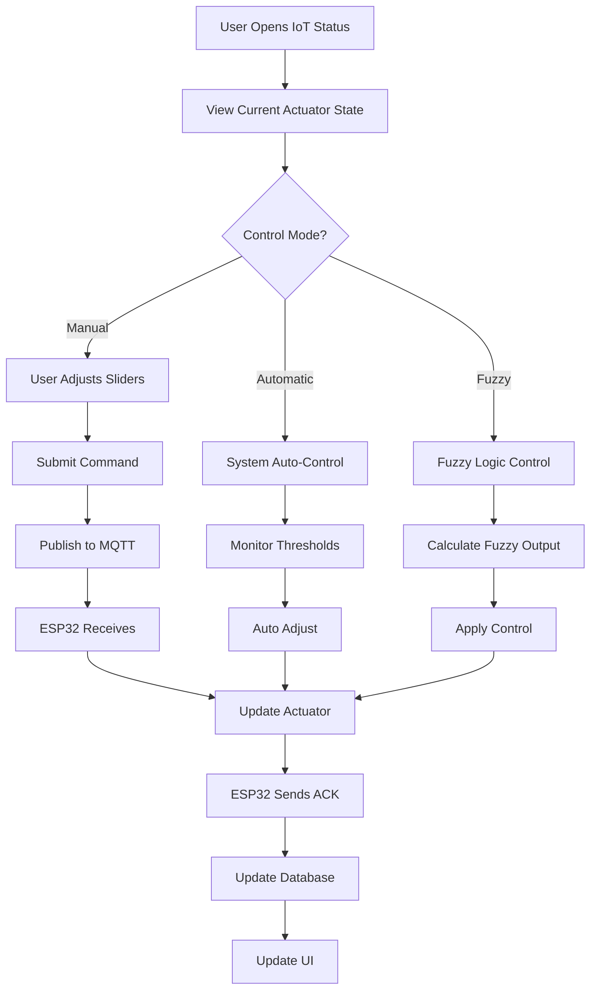

### Camera Streaming Flow

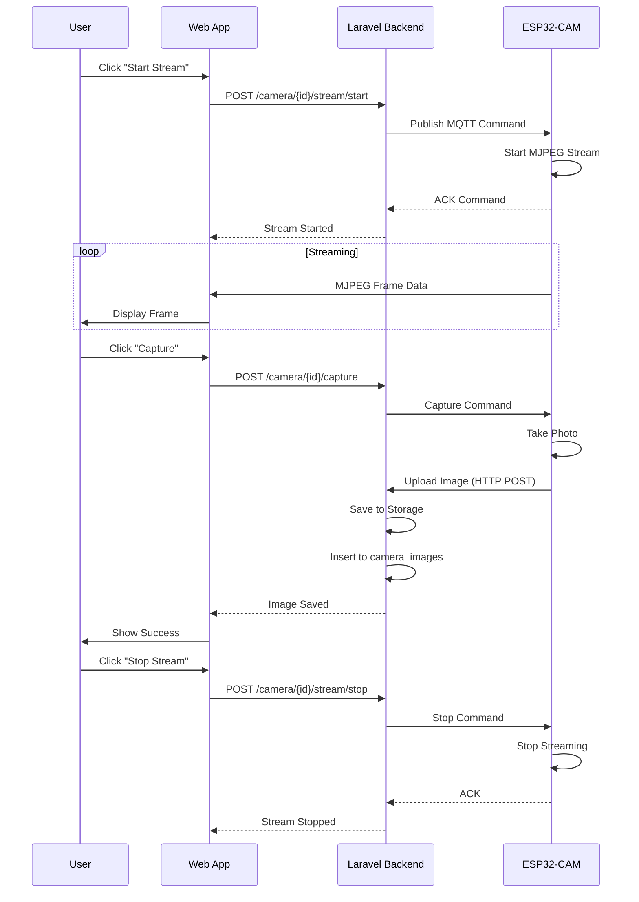

### Notification Alert Flow

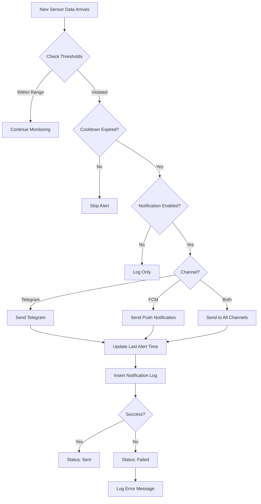

## Progressive Web App (PWA) Flow

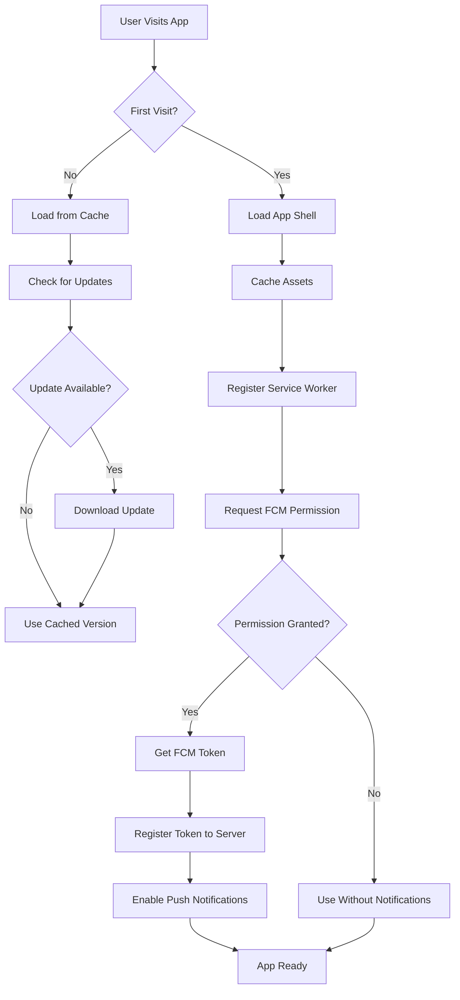

## Data Flow Architecture

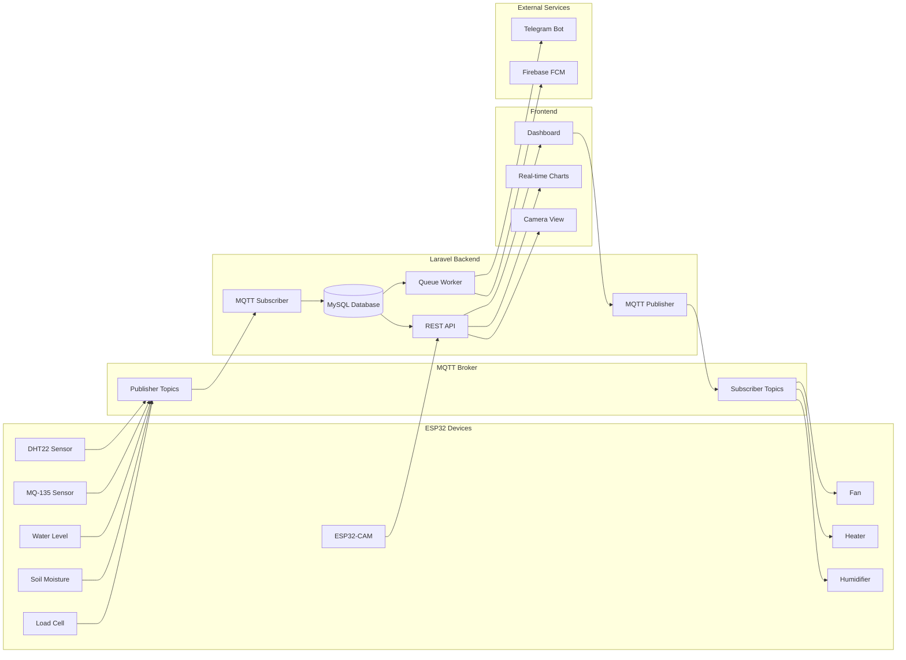

## Access Control Matrix

| Page/Feature         | Guest  | User   | Admin  | Notes                        |
| -------------------- | ------ | ------ | ------ | ---------------------------- |
| Login Page           | ✅     | ❌     | ❌     | Redirect if authenticated    |
| Register Page        | ✅     | ❌     | ❌     | Redirect if authenticated    |
| IoT Status           | ❌     | ✅     | ✅     | Default landing page         |
| Devices (Own)        | ❌     | ✅     | ✅     | User sees only owned devices |
| Live Camera          | ❌     | ✅     | ✅     | Stream own cameras           |
| Notifications        | ❌     | ✅     | ✅     | Personal settings            |
| Historical Data      | ❌     | ✅     | ✅     | Own device data              |
| Manage Users         | ❌     | ❌     | ✅     | Admin only - CRUD users      |
| Manage Devices (All) | ❌     | ❌     | ✅     | Admin only - Global access   |
| API: Send Commands   | ❌     | ✅     | ✅     | Own devices only (user)      |
| API: FCM Tokens      | ❌     | ✅     | ✅     | Personal tokens              |
| API: Camera Upload   | Public | Public | Public | For ESP32 (token auth)       |

## Responsive Breakpoints

### Mobile Menu (< 768px)

```
┌─────────────────┐
│ ☰ Menu     👤   │ ← Hamburger + User Avatar
├─────────────────┤
│                 │
│  Content Area   │
│                 │
│                 │
└─────────────────┘

On Menu Click:
┌─────────────────┐
│ [Overlay Active]│
│ ┌─────────────┐ │
│ │ ⚡ Menu  [X]│ │ ← Sidebar slides in
│ │─────────────│ │
│ │ 🔌 IoT     │ │
│ │ 📱 Devices │ │
│ │ 📹 Camera  │ │
│ │ 🔔 Notifs  │ │
│ │ 📊 History │ │
│ └─────────────┘ │
└─────────────────┘
```

### Desktop Menu (≥ 768px)

```
┌──────────┬─────────────────────────┐
│ ⚡ Menu  │  Navbar with Title      │
│──────────│─────────────────────────│
│ 🔌 IoT   │                         │
│ 📱 Device│   Content Area          │
│ 📹 Camera│                         │
│ 🔔 Notif │                         │
│ 📊 Chart │                         │
│          │                         │
│ (Admin)  │                         │
│ 👥 Users │                         │
│ 🔧 Mgmt  │                         │
│──────────│                         │
│ 🚪 Logout│                         │
└──────────┴─────────────────────────┘
```

## State Management

### Application States

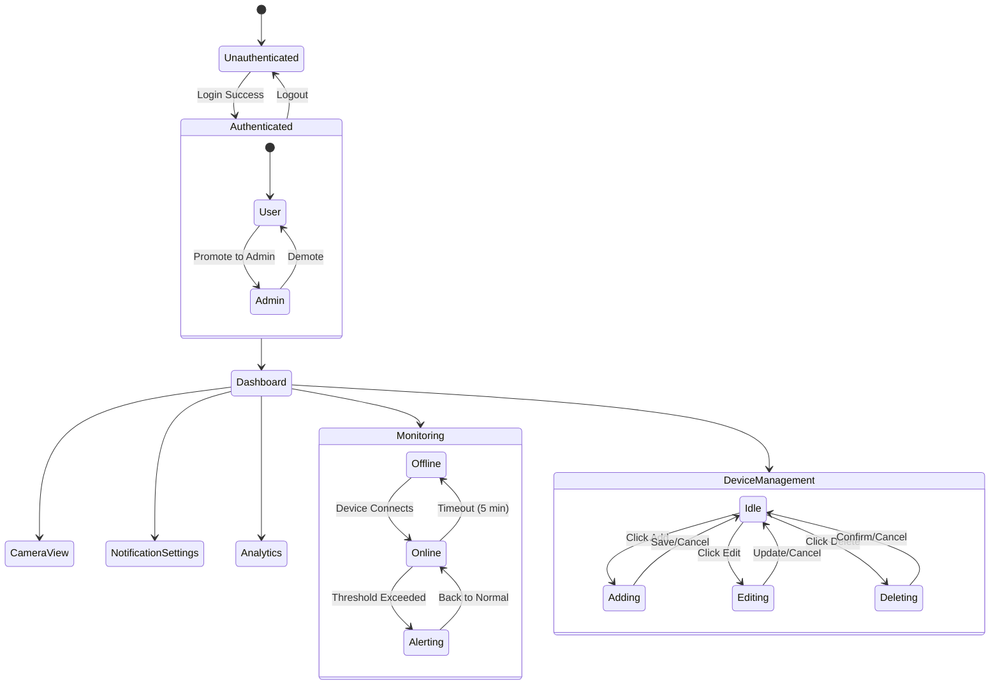

## Error Handling Flow

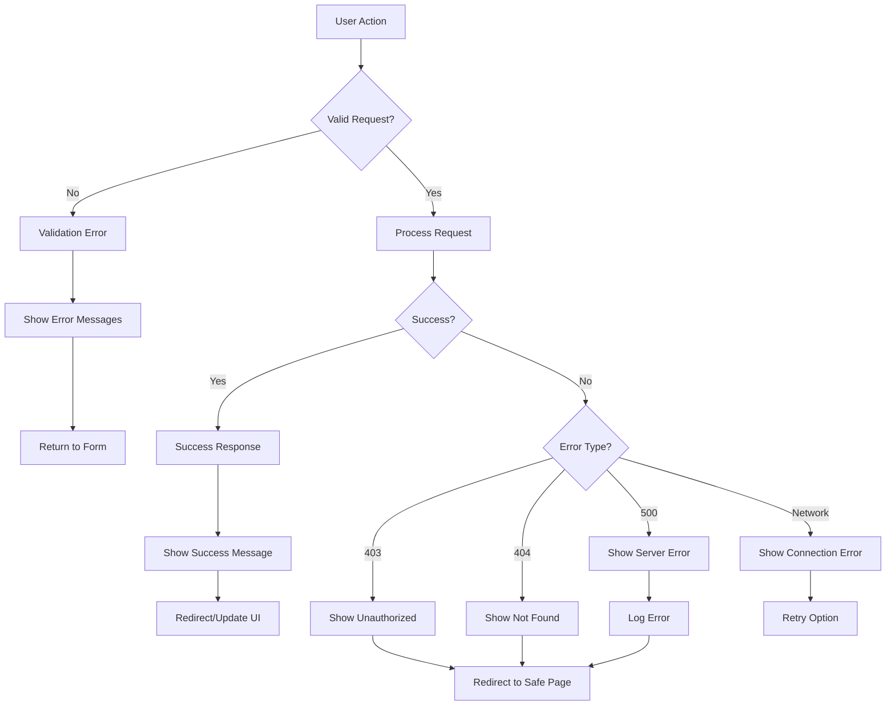

## Summary

### Key Navigation Patterns

1. **Default Route**: Authenticated users → IoT Status
2. **Admin Access**: Conditional menu items based on role
3. **Breadcrumb**: Not implemented (flat navigation)
4. **Mobile**: Hamburger menu with overlay
5. **Desktop**: Fixed sidebar navigation

### Performance Optimization

-   ⚡ Route caching (`php artisan route:cache`)
-   🔄 AJAX data loading (no full page reload)
-   📦 Asset bundling with Vite
-   💾 Database query optimization (indexes)
-   🎨 CSS/JS minification in production

### Security Layers

1. **Authentication**: Laravel Sanctum/Session
2. **Authorization**: Middleware (auth, admin)
3. **CSRF Protection**: All POST/PUT/DELETE
4. **Input Validation**: Form Requests
5. **XSS Prevention**: Blade escaping
6. **SQL Injection**: ORM/Query Builder

---

**Page Count**: 15+ unique pages  
**Route Count**: 40+ defined routes  
**User Flows**: 8 documented flows  
**Access Levels**: 3 (Guest, User, Admin)
