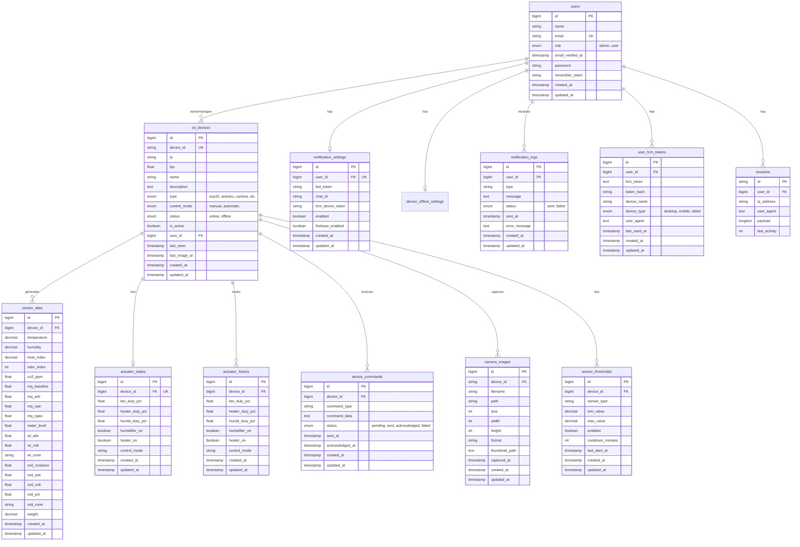

# Dokumentasi Database - IoT Monitoring System V3

## Gambaran Umum

Sistem ini adalah aplikasi monitoring IoT berbasis Laravel yang mengintegrasikan berbagai sensor, aktuator, dan kamera ESP32. Database dirancang untuk menyimpan data sensor real-time, mengelola perangkat IoT, mengontrol aktuator, dan menangani notifikasi multi-channel (Telegram, Firebase Cloud Messaging).

**Database Engine:** MySQL/MariaDB  
**Framework:** Laravel 11.x  
**Total Tables:** 14 tables (13 documented + migrations)

---

## Daftar Tabel

### Tabel Utama (Core Tables)

1. [users](#1-users) - Manajemen pengguna dan autentikasi
2. [iot_devices](#2-iot_devices) - Perangkat IoT yang terdaftar
3. [sensor_data](#3-sensor_data) - Data sensor real-time
4. [actuator_states](#4-actuator_states) - Status aktuator saat ini
5. [actuator_history](#5-actuator_history) - Riwayat perubahan aktuator
6. [device_commands](#6-device_commands) - Perintah yang dikirim ke perangkat

### Tabel Kamera (Camera Tables)

7. [camera_devices](#7-camera_devices) - Perangkat kamera (legacy/deprecated)
8. [camera_images](#8-camera_images) - Gambar yang diambil kamera

### Tabel Notifikasi (Notification Tables)

9. [notification_settings](#9-notification_settings) - Konfigurasi notifikasi per user
10. [notification_logs](#10-notification_logs) - Log pengiriman notifikasi
11. [user_fcm_tokens](#11-user_fcm_tokens) - Token FCM untuk push notification
12. [sensor_thresholds](#12-sensor_thresholds) - Threshold sensor untuk alert
13. [device_offline_settings](#13-device_offline_settings) - Konfigurasi device offline alert per user

### Tabel Sistem (System Tables)

> **Note:** Tabel `migrations` ada di database untuk tracking migration history Laravel, tetapi tidak didokumentasikan karena hanya digunakan internal oleh framework.

---

## Detail Tabel

### 1. users

Tabel untuk menyimpan data pengguna sistem dan autentikasi.

**Struktur Tabel:**

| Kolom             | Tipe Data            | Nullable | Default        | Keterangan             |
| ----------------- | -------------------- | -------- | -------------- | ---------------------- |
| id                | BIGINT UNSIGNED      | NO       | AUTO_INCREMENT | Primary key            |
| name              | VARCHAR(255)         | NO       | -              | Nama lengkap user      |
| email             | VARCHAR(255)         | NO       | -              | Email (unique)         |
| role              | ENUM('admin','user') | NO       | 'user'         | Role pengguna          |
| email_verified_at | TIMESTAMP            | YES      | NULL           | Waktu verifikasi email |
| password          | VARCHAR(255)         | NO       | -              | Password (hashed)      |
| remember_token    | VARCHAR(100)         | YES      | NULL           | Token remember me      |
| created_at        | TIMESTAMP            | YES      | NULL           | Waktu pembuatan        |
| updated_at        | TIMESTAMP            | YES      | NULL           | Waktu update terakhir  |

**Indexes:**

-   PRIMARY KEY: `id`
-   UNIQUE KEY: `email`

**Relationships:**

-   Has Many: `iot_devices` (FK: user_id)
-   Has One: `notification_settings` (FK: user_id)
-   Has Many: `notification_logs` (FK: user_id)
-   Has Many: `user_fcm_tokens` (FK: user_id)

**Constants:**

```php
const ROLE_ADMIN = 'admin';
const ROLE_USER = 'user';
```

---

### 2. iot_devices

Tabel utama untuk menyimpan semua perangkat IoT yang terdaftar dalam sistem.

**Struktur Tabel:**

| Kolom         | Tipe Data                  | Nullable | Default        | Keterangan                           |
| ------------- | -------------------------- | -------- | -------------- | ------------------------------------ |
| id            | BIGINT UNSIGNED            | NO       | AUTO_INCREMENT | Primary key                          |
| device_id     | VARCHAR(255)               | NO       | -              | ID unik perangkat (unique)           |
| ip            | VARCHAR(255)               | YES      | NULL           | IP address perangkat                 |
| fps           | FLOAT                      | YES      | NULL           | Frame per second (untuk kamera)      |
| name          | VARCHAR(255)               | NO       | -              | Nama perangkat                       |
| description   | TEXT                       | YES      | NULL           | Deskripsi perangkat                  |
| type          | ENUM                       | NO       | 'sensor'       | Tipe perangkat (lihat enum di bawah) |
| control_mode  | ENUM('manual','automatic') | NO       | 'automatic'    | Mode kontrol                         |
| status        | ENUM('online','offline')   | NO       | 'offline'      | Status koneksi                       |
| is_active     | BOOLEAN                    | NO       | TRUE           | Status aktif/enabled                 |
| user_id       | BIGINT UNSIGNED            | YES      | NULL           | ID pemilik perangkat                 |
| last_seen     | TIMESTAMP                  | YES      | NULL           | Terakhir kali terlihat online        |
| last_image_at | TIMESTAMP                  | YES      | NULL           | Terakhir upload gambar (kamera)      |
| created_at    | TIMESTAMP                  | YES      | NULL           | Waktu pembuatan                      |
| updated_at    | TIMESTAMP                  | YES      | NULL           | Waktu update terakhir                |

**Device Type ENUM Values:**

-   `esp32` - ESP32 device
-   `arduino` - Arduino device
-   `raspberry_pi` - Raspberry Pi
-   `sensor` - Generic sensor
-   `sensor_node` - Sensor node
-   `actuator` - Actuator device
-   `gateway` - IoT gateway
-   `iot` - Generic IoT device
-   `camera` - Camera device
-   `controller` - Controller device

**Indexes:**

-   PRIMARY KEY: `id`
-   UNIQUE KEY: `device_id`
-   INDEX: `device_id`
-   INDEX: `is_active`
-   INDEX: `type`
-   FOREIGN KEY: `user_id` → users(id) ON DELETE SET NULL

**Relationships:**

-   Belongs To: `users` (FK: user_id)
-   Has Many: `sensor_data` (FK: device_id, foreign key on `id` column)
-   Has One: `actuator_states` (FK: device_id, foreign key on `id` column)
-   Has Many: `actuator_history` (FK: device_id, foreign key on `id` column)
-   Has Many: `device_commands` (FK: device_id, foreign key on `id` column)
-   Has Many: `camera_images` (FK: device_id, using string `device_id` column)
-   Has Many: `sensor_thresholds` (FK: device_id, foreign key on `id` column)

**Business Logic:**

-   Device dianggap online jika `last_seen` tidak lebih dari 5 menit dari waktu sekarang
-   Method `isOnline()` dan `isEnabled()` tersedia di model

---

### 3. sensor_data

Tabel untuk menyimpan data sensor real-time dari berbagai jenis sensor.

**Struktur Tabel:**

| Kolom                         | Tipe Data       | Nullable | Default        | Keterangan                     |
| ----------------------------- | --------------- | -------- | -------------- | ------------------------------ |
| id                            | BIGINT UNSIGNED | NO       | AUTO_INCREMENT | Primary key                    |
| device_id                     | BIGINT UNSIGNED | NO       | -              | ID perangkat IoT               |
| **DHT22 Sensor**              |                 |          |                |                                |
| temperature                   | DECIMAL(5,2)    | YES      | NULL           | Suhu (°C)                      |
| humidity                      | DECIMAL(5,2)    | YES      | NULL           | Kelembaban (%)                 |
| heat_index                    | DECIMAL(5,2)    | YES      | NULL           | Indeks panas (°C)              |
| **MQ-135 Air Quality Sensor** |                 |          |                |                                |
| odor_index                    | INTEGER         | YES      | NULL           | Indeks bau                     |
| co2_ppm                       | FLOAT           | YES      | NULL           | CO2 dalam PPM                  |
| mq_baseline                   | FLOAT           | YES      | NULL           | Baseline voltage MQ-135        |
| mq_adc                        | FLOAT           | YES      | NULL           | Raw ADC MQ-135                 |
| mq_vpin                       | FLOAT           | YES      | NULL           | Pin voltage MQ-135             |
| mq_vgas                       | FLOAT           | YES      | NULL           | Gas voltage MQ-135             |
| vpin                          | DECIMAL(8,2)    | YES      | NULL           | Vpin (legacy)                  |
| vgas                          | DECIMAL(8,2)    | YES      | NULL           | Vgas (legacy)                  |
| **Water Level Sensor**        |                 |          |                |                                |
| water_level                   | DECIMAL(5,2)    | YES      | NULL           | Level air (%)                  |
| wl_adc                        | FLOAT           | YES      | NULL           | Raw ADC water level            |
| wl_volt                       | FLOAT           | YES      | NULL           | Voltage water level            |
| wl_zone                       | VARCHAR(255)    | YES      | NULL           | Zona air (DRY/LOW/MID/HIGH)    |
| water_zone                    | VARCHAR(20)     | YES      | NULL           | Zona (low/normal/high) legacy  |
| **Soil Moisture Sensor**      |                 |          |                |                                |
| soil_moisture                 | DECIMAL(5,2)    | YES      | NULL           | Kelembaban tanah (%)           |
| soil_adc                      | FLOAT           | YES      | NULL           | Raw ADC soil                   |
| soil_volt                     | FLOAT           | YES      | NULL           | Voltage soil                   |
| soil_pct                      | FLOAT           | YES      | NULL           | Soil percentage (ESP32 format) |
| soil_zone                     | VARCHAR(20)     | YES      | NULL           | Zona tanah (dry/moist/wet)     |
| **Load Cell / Weight Sensor** |                 |          |                |                                |
| weight                        | DECIMAL(8,2)    | YES      | NULL           | Berat (gram)                   |
| **Timestamps**                |                 |          |                |                                |
| created_at                    | TIMESTAMP       | YES      | NULL           | Waktu pengambilan data         |
| updated_at                    | TIMESTAMP       | YES      | NULL           | Waktu update                   |

**Indexes:**

-   PRIMARY KEY: `id`
-   COMPOSITE INDEX: `device_id, created_at` (untuk query time-series)
-   FOREIGN KEY: `device_id` → iot_devices(id) ON DELETE CASCADE

**Relationships:**

-   Belongs To: `iot_devices` (FK: device_id)

**Catatan:**

-   Tidak semua sensor akan memiliki data di setiap record (nullable)
-   Data sensor disimpan berdasarkan timestamp `created_at`
-   Terdapat duplikasi field untuk backward compatibility (vpin/vgas vs mq_vpin/mq_vgas, water_zone vs wl_zone)

---

### 4. actuator_states

Tabel untuk menyimpan status **terkini** dari setiap aktuator pada perangkat IoT.

**Struktur Tabel:**

| Kolom           | Tipe Data       | Nullable | Default        | Keterangan                       |
| --------------- | --------------- | -------- | -------------- | -------------------------------- |
| id              | BIGINT UNSIGNED | NO       | AUTO_INCREMENT | Primary key                      |
| device_id       | BIGINT UNSIGNED | NO       | -              | ID perangkat IoT (unique)        |
| fan_duty_pct    | FLOAT           | NO       | 0              | Duty cycle kipas (0-100%)        |
| heater_duty_pct | FLOAT           | NO       | 0              | Duty cycle heater (0-100%)       |
| humid_duty_pct  | FLOAT           | NO       | 0              | Duty cycle humidifier (0-100%)   |
| humidifier_on   | BOOLEAN         | NO       | FALSE          | Status ON/OFF humidifier         |
| heater_on       | BOOLEAN         | NO       | FALSE          | Status ON/OFF heater             |
| control_mode    | VARCHAR(255)    | NO       | 'FUZZY'        | Mode kontrol (FUZZY/MANUAL/AUTO) |
| created_at      | TIMESTAMP       | YES      | NULL           | Waktu pembuatan                  |
| updated_at      | TIMESTAMP       | YES      | NULL           | Waktu update terakhir            |

**Indexes:**

-   PRIMARY KEY: `id`
-   UNIQUE KEY: `device_id` (hanya satu record per device)
-   FOREIGN KEY: `device_id` → iot_devices(id) ON DELETE CASCADE

**Relationships:**

-   Belongs To: `iot_devices` (FK: device_id)

**Catatan:**

-   Hanya menyimpan state **terkini**, bukan historis
-   Tabel ini di-update setiap kali ada perubahan aktuator
-   Legacy columns (fan_duty, humidifier_mode, dll) sudah dihapus dan diganti dengan format ESP32

---

### 5. actuator_history

Tabel untuk menyimpan **riwayat perubahan** status aktuator untuk keperluan analisis dan tracking.

**Struktur Tabel:**

| Kolom           | Tipe Data       | Nullable | Default        | Keterangan                       |
| --------------- | --------------- | -------- | -------------- | -------------------------------- |
| id              | BIGINT UNSIGNED | NO       | AUTO_INCREMENT | Primary key                      |
| device_id       | BIGINT UNSIGNED | NO       | -              | ID perangkat IoT                 |
| fan_duty_pct    | FLOAT           | NO       | 0              | Duty cycle kipas (0-100%)        |
| heater_duty_pct | FLOAT           | NO       | 0              | Duty cycle heater (0-100%)       |
| humid_duty_pct  | FLOAT           | NO       | 0              | Duty cycle humidifier (0-100%)   |
| humidifier_on   | BOOLEAN         | NO       | FALSE          | Status ON/OFF humidifier         |
| heater_on       | BOOLEAN         | NO       | FALSE          | Status ON/OFF heater             |
| control_mode    | VARCHAR(255)    | NO       | 'FUZZY'        | Mode kontrol (FUZZY/MANUAL/AUTO) |
| created_at      | TIMESTAMP       | YES      | NULL           | Waktu snapshot ini dibuat        |
| updated_at      | TIMESTAMP       | YES      | NULL           | Waktu update                     |

**Indexes:**

-   PRIMARY KEY: `id`
-   COMPOSITE INDEX: `device_id, created_at` (untuk query time-series)
-   FOREIGN KEY: `device_id` → iot_devices(id) ON DELETE CASCADE

**Relationships:**

-   Belongs To: `iot_devices` (FK: device_id)

**Catatan:**

-   Record baru dibuat setiap kali ada perubahan status aktuator
-   Digunakan untuk analisis historis dan grafik

---

### 6. device_commands

Tabel untuk menyimpan perintah yang dikirim ke perangkat IoT.

**Struktur Tabel:**

| Kolom           | Tipe Data       | Nullable | Default        | Keterangan                  |
| --------------- | --------------- | -------- | -------------- | --------------------------- |
| id              | BIGINT UNSIGNED | NO       | AUTO_INCREMENT | Primary key                 |
| device_id       | BIGINT UNSIGNED | NO       | -              | ID perangkat IoT            |
| command_type    | VARCHAR(255)    | NO       | -              | Tipe perintah               |
| command_data    | TEXT            | YES      | NULL           | Data perintah (JSON)        |
| status          | ENUM            | NO       | 'pending'      | Status perintah             |
| sent_at         | TIMESTAMP       | YES      | NULL           | Waktu dikirim               |
| acknowledged_at | TIMESTAMP       | YES      | NULL           | Waktu di-acknowledge device |
| created_at      | TIMESTAMP       | YES      | NULL           | Waktu pembuatan perintah    |
| updated_at      | TIMESTAMP       | YES      | NULL           | Waktu update                |

**Command Type Values:**

-   `feeder_open` - Buka feeder
-   `feeder_close` - Tutup feeder
-   `feeder_feed` - Jalankan feeding
-   `custom` - Perintah custom
-   `start_stream` - Mulai streaming (kamera)
-   `stop_stream` - Stop streaming (kamera)
-   `flash_on` - Nyalakan flash (kamera)
-   `flash_off` - Matikan flash (kamera)

**Status ENUM Values:**

-   `pending` - Menunggu dikirim
-   `sent` - Sudah dikirim
-   `acknowledged` - Sudah diterima device
-   `failed` - Gagal

**Indexes:**

-   PRIMARY KEY: `id`
-   COMPOSITE INDEX: `device_id, status`
-   FOREIGN KEY: `device_id` → iot_devices(id) ON DELETE CASCADE

**Relationships:**

-   Belongs To: `iot_devices` (FK: device_id)

---

### 7. camera_devices

> **⚠️ DEPRECATED:** Tabel ini sudah tidak digunakan lagi. Kamera sekarang diintegrasikan langsung ke tabel `iot_devices` dengan type='camera'.

**Struktur Tabel:**

| Kolom       | Tipe Data                | Nullable | Default        | Keterangan              |
| ----------- | ------------------------ | -------- | -------------- | ----------------------- |
| id          | BIGINT UNSIGNED          | NO       | AUTO_INCREMENT | Primary key             |
| device_id   | VARCHAR(255)             | NO       | -              | ID unik kamera (unique) |
| name        | VARCHAR(255)             | NO       | -              | Nama kamera             |
| stream_url  | VARCHAR(255)             | NO       | -              | URL streaming           |
| type        | VARCHAR(255)             | NO       | 'esp32cam'     | Tipe kamera             |
| status      | ENUM('online','offline') | NO       | 'offline'      | Status                  |
| resolution  | VARCHAR(255)             | YES      | NULL           | Resolusi                |
| fps         | INTEGER                  | YES      | NULL           | Frame per second        |
| description | TEXT                     | YES      | NULL           | Deskripsi               |
| last_seen   | TIMESTAMP                | YES      | NULL           | Terakhir terlihat       |
| created_at  | TIMESTAMP                | YES      | NULL           | Waktu pembuatan         |
| updated_at  | TIMESTAMP                | YES      | NULL           | Waktu update            |

**Indexes:**

-   PRIMARY KEY: `id`
-   UNIQUE KEY: `device_id`

---

### 8. camera_images

Tabel untuk menyimpan gambar yang diupload oleh kamera ESP32.

**Struktur Tabel:**

| Kolom          | Tipe Data       | Nullable | Default        | Keterangan           |
| -------------- | --------------- | -------- | -------------- | -------------------- |
| id             | BIGINT UNSIGNED | NO       | AUTO_INCREMENT | Primary key          |
| device_id      | VARCHAR(255)    | NO       | -              | ID perangkat kamera  |
| filename       | VARCHAR(255)    | NO       | -              | Nama file            |
| path           | VARCHAR(255)    | NO       | -              | Path file di storage |
| size           | INTEGER         | NO       | -              | Ukuran file (bytes)  |
| width          | INTEGER         | YES      | NULL           | Lebar gambar (px)    |
| height         | INTEGER         | YES      | NULL           | Tinggi gambar (px)   |
| format         | VARCHAR(255)    | NO       | 'jpeg'         | Format gambar        |
| thumbnail_path | TEXT            | YES      | NULL           | Path thumbnail       |
| captured_at    | TIMESTAMP       | NO       | -              | Waktu capture        |
| created_at     | TIMESTAMP       | YES      | NULL           | Waktu upload         |
| updated_at     | TIMESTAMP       | YES      | NULL           | Waktu update         |

**Indexes:**

-   PRIMARY KEY: `id`
-   INDEX: `device_id`
-   INDEX: `captured_at`
-   FOREIGN KEY: `device_id` → iot_devices(device_id) ON DELETE CASCADE

**Relationships:**

-   Belongs To: `iot_devices` (FK: device_id, menggunakan string device_id bukan id)

**Catatan:**

-   Gambar disimpan di `storage/app/public/camera_images/{device_id}/`
-   Thumbnail (optional) disimpan terpisah

---

### 9. notification_settings

Tabel untuk menyimpan konfigurasi notifikasi per user.

**Struktur Tabel:**

| Kolom            | Tipe Data       | Nullable | Default        | Keterangan                    |
| ---------------- | --------------- | -------- | -------------- | ----------------------------- |
| id               | BIGINT UNSIGNED | NO       | AUTO_INCREMENT | Primary key                   |
| user_id          | BIGINT UNSIGNED | NO       | -              | ID user (unique)              |
| bot_token        | VARCHAR(255)    | YES      | NULL           | Telegram bot token            |
| chat_id          | VARCHAR(255)    | YES      | NULL           | Telegram chat ID              |
| fcm_device_token | VARCHAR(255)    | YES      | NULL           | FCM device token (deprecated) |
| enabled          | BOOLEAN         | NO       | FALSE          | Telegram enabled              |
| firebase_enabled | BOOLEAN         | NO       | FALSE          | Firebase enabled              |
| created_at       | TIMESTAMP       | YES      | NULL           | Waktu pembuatan               |
| updated_at       | TIMESTAMP       | YES      | NULL           | Waktu update                  |

**Indexes:**

-   PRIMARY KEY: `id`
-   UNIQUE KEY: `user_id`
-   FOREIGN KEY: `user_id` → users(id) ON DELETE CASCADE

**Relationships:**

-   Belongs To: `users` (FK: user_id)

**Catatan:**

-   Field `fcm_device_token` deprecated, diganti dengan tabel terpisah `user_fcm_tokens`
-   Support multi-channel: Telegram dan Firebase Cloud Messaging

---

### 10. notification_logs

Tabel untuk menyimpan log pengiriman notifikasi.

**Struktur Tabel:**

| Kolom         | Tipe Data             | Nullable | Default        | Keterangan                |
| ------------- | --------------------- | -------- | -------------- | ------------------------- |
| id            | BIGINT UNSIGNED       | NO       | AUTO_INCREMENT | Primary key               |
| user_id       | BIGINT UNSIGNED       | NO       | -              | ID user penerima          |
| type          | VARCHAR(255)          | NO       | -              | Tipe notifikasi           |
| message       | TEXT                  | NO       | -              | Isi pesan                 |
| status        | ENUM('sent','failed') | NO       | 'sent'         | Status pengiriman         |
| sent_at       | TIMESTAMP             | YES      | NULL           | Waktu dikirim             |
| error_message | TEXT                  | YES      | NULL           | Pesan error (jika failed) |
| created_at    | TIMESTAMP             | YES      | NULL           | Waktu pembuatan           |
| updated_at    | TIMESTAMP             | YES      | NULL           | Waktu update              |

**Notification Type Values:**

-   `sensor_alert` - Alert dari sensor threshold
-   `device_status` - Alert status device (offline/online)
-   `manual_test` - Test notification manual
-   `device_offline` - Device offline alert (FCM)
-   `sensor_threshold` - Sensor threshold violated (Telegram)

**Indexes:**

-   PRIMARY KEY: `id`
-   COMPOSITE INDEX: `user_id, created_at`
-   FOREIGN KEY: `user_id` → users(id) ON DELETE CASCADE

**Relationships:**

-   Belongs To: `users` (FK: user_id)

---

### 11. user_fcm_tokens

Tabel untuk menyimpan Firebase Cloud Messaging (FCM) tokens per user untuk multi-device push notifications.

**Struktur Tabel:**

| Kolom        | Tipe Data       | Nullable | Default        | Keterangan                              |
| ------------ | --------------- | -------- | -------------- | --------------------------------------- |
| id           | BIGINT UNSIGNED | NO       | AUTO_INCREMENT | Primary key                             |
| user_id      | BIGINT UNSIGNED | NO       | -              | ID user                                 |
| fcm_token    | TEXT            | NO       | -              | FCM token dari browser/device           |
| token_hash   | VARCHAR(64)     | YES      | NULL           | Hash token untuk uniqueness             |
| device_name  | VARCHAR(255)    | YES      | NULL           | Nama device (e.g., "Chrome on Windows") |
| device_type  | ENUM            | NO       | 'desktop'      | Tipe device                             |
| user_agent   | TEXT            | YES      | NULL           | User agent string                       |
| last_used_at | TIMESTAMP       | YES      | NULL           | Terakhir kali digunakan                 |
| created_at   | TIMESTAMP       | YES      | NULL           | Waktu pembuatan                         |
| updated_at   | TIMESTAMP       | YES      | NULL           | Waktu update                            |

**Device Type ENUM Values:**

-   `desktop` - Desktop/laptop
-   `mobile` - Mobile phone
-   `tablet` - Tablet

**Indexes:**

-   PRIMARY KEY: `id`
-   INDEX: `user_id`
-   INDEX: `last_used_at`
-   UNIQUE KEY: `user_id, token_hash` (composite unique)
-   FOREIGN KEY: `user_id` → users(id) ON DELETE CASCADE

**Relationships:**

-   Belongs To: `users` (FK: user_id)

**Catatan:**

-   Satu user bisa memiliki banyak FCM tokens (multi-device)
-   Token di-hash untuk mencegah duplikasi
-   Auto cleanup tokens yang sudah tidak digunakan

---

### 12. sensor_thresholds

Tabel untuk menyimpan konfigurasi threshold sensor yang akan memicu notifikasi alert.

**Struktur Tabel:**

| Kolom            | Tipe Data       | Nullable | Default        | Keterangan                   |
| ---------------- | --------------- | -------- | -------------- | ---------------------------- |
| id               | BIGINT UNSIGNED | NO       | AUTO_INCREMENT | Primary key                  |
| device_id        | BIGINT UNSIGNED | NO       | -              | ID perangkat IoT             |
| sensor_type      | VARCHAR(255)    | NO       | -              | Tipe sensor                  |
| min_value        | DECIMAL(8,2)    | YES      | NULL           | Nilai minimum                |
| max_value        | DECIMAL(8,2)    | YES      | NULL           | Nilai maksimum               |
| enabled          | BOOLEAN         | NO       | TRUE           | Status aktif                 |
| cooldown_minutes | INTEGER         | NO       | 30             | Cooldown antar alert (menit) |
| last_alert_at    | TIMESTAMP       | YES      | NULL           | Waktu alert terakhir         |
| created_at       | TIMESTAMP       | YES      | NULL           | Waktu pembuatan              |
| updated_at       | TIMESTAMP       | YES      | NULL           | Waktu update                 |

**Sensor Type Values:**

-   `temperature` - Threshold suhu
-   `humidity` - Threshold kelembaban
-   `air_quality` - Threshold kualitas udara (CO2 PPM)

**Default Values (Auto-created):**

-   Temperature: min=15°C, max=35°C
-   Humidity: min=30%, max=80%
-   Air Quality: max=200 PPM

**Indexes:**

-   PRIMARY KEY: `id`
-   UNIQUE KEY: `device_id, sensor_type` (composite unique)
-   FOREIGN KEY: `device_id` → iot_devices(id) ON DELETE CASCADE

**Relationships:**

-   Belongs To: `iot_devices` (FK: device_id)

**Catatan:**

-   Cooldown mencegah spam notifikasi
-   Alert hanya dikirim jika `enabled=true` dan cooldown sudah habis

---

### 13. device_offline_settings

Tabel untuk menyimpan konfigurasi device offline alert per user.

**Struktur Tabel:**

| Kolom                    | Tipe Data       | Nullable | Default        | Keterangan                                |
| ------------------------ | --------------- | -------- | -------------- | ----------------------------------------- |
| id                       | BIGINT UNSIGNED | NO       | AUTO_INCREMENT | Primary key                               |
| user_id                  | BIGINT UNSIGNED | NO       | -              | ID user (unique)                          |
| offline_timeout_minutes  | INTEGER         | NO       | 5              | Menit sebelum device dianggap offline     |
| notification_enabled     | BOOLEAN         | NO       | TRUE           | Enable/disable offline notifications      |
| last_notified_at         | TIMESTAMP       | YES      | NULL           | Waktu terakhir notifikasi offline dikirim |
| last_notified_device_ids | JSON            | YES      | NULL           | Array device IDs yang sudah dinotifikasi  |
| created_at               | TIMESTAMP       | YES      | NULL           | Waktu pembuatan                           |
| updated_at               | TIMESTAMP       | YES      | NULL           | Waktu update terakhir                     |

**Indexes:**

-   PRIMARY KEY: `id`
-   UNIQUE KEY: `user_id`
-   FOREIGN KEY: `user_id` → users(id) ON DELETE CASCADE

**Relationships:**

-   Belongs To: `users` (FK: user_id)

**Business Logic:**

-   Device dianggap offline jika `last_seen` lebih dari `offline_timeout_minutes` dari sekarang
-   Notifikasi dikirim via Firebase Cloud Messaging (FCM) ke semua device user
-   `last_notified_device_ids` menyimpan array device yang sudah dinotifikasi untuk mencegah spam
-   Notifikasi baru dikirim jika ada device baru yang offline atau device yang sudah online kembali offline lagi

**Default Settings:**

-   `offline_timeout_minutes`: 5 menit
-   `notification_enabled`: true

**Use Case:**

Dijalankan via Laravel Scheduler (Artisan Command) setiap menit untuk cek device yang offline dan kirim notifikasi ke pemilik device.

---

### 14. sessions

Tabel untuk menyimpan session Laravel (authentication).

**Struktur Tabel:**

| Kolom         | Tipe Data       | Nullable | Default | Keterangan                   |
| ------------- | --------------- | -------- | ------- | ---------------------------- |
| id            | VARCHAR(255)    | NO       | -       | Session ID (primary)         |
| user_id       | BIGINT UNSIGNED | YES      | NULL    | ID user yang login           |
| ip_address    | VARCHAR(45)     | YES      | NULL    | IP address                   |
| user_agent    | TEXT            | YES      | NULL    | User agent                   |
| payload       | LONGTEXT        | NO       | -       | Session data (serialized)    |
| last_activity | INTEGER         | NO       | -       | Unix timestamp last activity |

**Indexes:**

-   PRIMARY KEY: `id`
-   INDEX: `user_id`
-   INDEX: `last_activity`

---

### 15. password_reset_tokens

Tabel untuk menyimpan token reset password.

**Struktur Tabel:**

| Kolom      | Tipe Data    | Nullable | Default | Keterangan            |
| ---------- | ------------ | -------- | ------- | --------------------- |
| email      | VARCHAR(255) | NO       | -       | Email user (primary)  |
| token      | VARCHAR(255) | NO       | -       | Reset token           |
| created_at | TIMESTAMP    | YES      | NULL    | Waktu pembuatan token |

**Indexes:**

-   PRIMARY KEY: `email`

---

## Tabel Deprecated / Tidak Digunakan

### ❌ cache, cache_locks

> **STATUS:** Tabel Laravel standard, ada di database tapi tidak aktif digunakan (cache driver menggunakan file/redis)

Tabel untuk Laravel cache driver.

**cache:**

| Kolom      | Tipe Data    | Nullable | Default | Keterangan                |
| ---------- | ------------ | -------- | ------- | ------------------------- |
| key        | VARCHAR(255) | NO       | -       | Cache key (primary)       |
| value      | MEDIUMTEXT   | NO       | -       | Cache value               |
| expiration | INTEGER      | NO       | -       | Unix timestamp expiration |

**cache_locks:**

| Kolom      | Tipe Data    | Nullable | Default | Keterangan                |
| ---------- | ------------ | -------- | ------- | ------------------------- |
| key        | VARCHAR(255) | NO       | -       | Lock key (primary)        |
| owner      | VARCHAR(255) | NO       | -       | Lock owner                |
| expiration | INTEGER      | NO       | -       | Unix timestamp expiration |

**Indexes:**

-   PRIMARY KEY: `key` (both tables)

---

### ❌ jobs, job_batches, failed_jobs

> **STATUS:** Tabel Laravel standard, ada di database tapi tidak aktif digunakan (queue menggunakan database tapi via service workers)

Tabel untuk Laravel queue system.

**jobs:**

| Kolom        | Tipe Data        | Nullable | Default        | Keterangan          |
| ------------ | ---------------- | -------- | -------------- | ------------------- |
| id           | BIGINT UNSIGNED  | NO       | AUTO_INCREMENT | Primary key         |
| queue        | VARCHAR(255)     | NO       | -              | Queue name          |
| payload      | LONGTEXT         | NO       | -              | Job payload         |
| attempts     | TINYINT UNSIGNED | NO       | -              | Jumlah attempts     |
| reserved_at  | INTEGER UNSIGNED | YES      | NULL           | Reserved timestamp  |
| available_at | INTEGER UNSIGNED | NO       | -              | Available timestamp |
| created_at   | INTEGER UNSIGNED | NO       | -              | Created timestamp   |

**Indexes:**

-   PRIMARY KEY: `id`
-   INDEX: `queue`

**job_batches:**

| Kolom          | Tipe Data    | Nullable | Default | Keterangan          |
| -------------- | ------------ | -------- | ------- | ------------------- |
| id             | VARCHAR(255) | NO       | -       | Batch ID (primary)  |
| name           | VARCHAR(255) | NO       | -       | Batch name          |
| total_jobs     | INTEGER      | NO       | -       | Total jobs          |
| pending_jobs   | INTEGER      | NO       | -       | Pending jobs        |
| failed_jobs    | INTEGER      | NO       | -       | Failed jobs         |
| failed_job_ids | LONGTEXT     | NO       | -       | Failed job IDs      |
| options        | MEDIUMTEXT   | YES      | NULL    | Batch options       |
| cancelled_at   | INTEGER      | YES      | NULL    | Cancelled timestamp |
| created_at     | INTEGER      | NO       | -       | Created timestamp   |
| finished_at    | INTEGER      | YES      | NULL    | Finished timestamp  |

**failed_jobs:**

| Kolom      | Tipe Data       | Nullable | Default           | Keterangan        |
| ---------- | --------------- | -------- | ----------------- | ----------------- |
| id         | BIGINT UNSIGNED | NO       | AUTO_INCREMENT    | Primary key       |
| uuid       | VARCHAR(255)    | NO       | -                 | Job UUID (unique) |
| connection | TEXT            | NO       | -                 | Connection name   |
| queue      | TEXT            | NO       | -                 | Queue name        |
| payload    | LONGTEXT        | NO       | -                 | Job payload       |
| exception  | LONGTEXT        | NO       | -                 | Exception message |
| failed_at  | TIMESTAMP       | NO       | CURRENT_TIMESTAMP | Failed timestamp  |

**Indexes:**

-   PRIMARY KEY: `id`
-   UNIQUE KEY: `uuid`

---

## Entity Relationship Diagram (ERD)



---

## Relasi Antar Tabel

### One-to-Many Relationships

1. **users → iot_devices**

    - FK: `iot_devices.user_id` → `users.id`
    - ON DELETE: SET NULL
    - Satu user dapat memiliki banyak perangkat

2. **iot_devices → sensor_data**

    - FK: `sensor_data.device_id` → `iot_devices.id`
    - ON DELETE: CASCADE
    - Satu device dapat menghasilkan banyak data sensor

3. **iot_devices → actuator_history**

    - FK: `actuator_history.device_id` → `iot_devices.id`
    - ON DELETE: CASCADE
    - Satu device dapat memiliki banyak record history

4. **iot_devices → device_commands**

    - FK: `device_commands.device_id` → `iot_devices.id`
    - ON DELETE: CASCADE
    - Satu device dapat menerima banyak perintah

5. **iot_devices → camera_images**

    - FK: `camera_images.device_id` → `iot_devices.device_id` (string)
    - ON DELETE: CASCADE
    - Satu kamera dapat menghasilkan banyak gambar

6. **iot_devices → sensor_thresholds**

    - FK: `sensor_thresholds.device_id` → `iot_devices.id`
    - ON DELETE: CASCADE
    - Satu device dapat memiliki banyak threshold (per sensor type)

7. **users → notification_logs**

    - FK: `notification_logs.user_id` → `users.id`
    - ON DELETE: CASCADE
    - Satu user dapat menerima banyak notifikasi

8. **users → user_fcm_tokens**

    - FK: `user_fcm_tokens.user_id` → `users.id`
    - ON DELETE: CASCADE
    - Satu user dapat memiliki banyak FCM tokens (multi-device)

9. **users → sessions**
    - FK: `sessions.user_id` → `users.id`
    - No explicit ON DELETE (handled by Laravel)

### One-to-One Relationships

1. **users → notification_settings**

    - FK: `notification_settings.user_id` → `users.id`
    - UNIQUE: `user_id`
    - ON DELETE: CASCADE
    - Satu user hanya memiliki satu konfigurasi notifikasi

2. **users → device_offline_settings**

    - FK: `device_offline_settings.user_id` → `users.id`
    - UNIQUE: `user_id`
    - ON DELETE: CASCADE
    - Satu user hanya memiliki satu konfigurasi device offline alert

3. **iot_devices → actuator_states**
    - FK: `actuator_states.device_id` → `iot_devices.id`
    - UNIQUE: `device_id`
    - ON DELETE: CASCADE
    - Satu device hanya memiliki satu state aktuator terkini

---

## Indexes dan Optimasi

### Composite Indexes

1. **sensor_data**: `(device_id, created_at)`

    - Optimasi untuk query time-series data sensor
    - Contoh: `SELECT * FROM sensor_data WHERE device_id = ? ORDER BY created_at DESC`

2. **actuator_history**: `(device_id, created_at)`

    - Optimasi untuk query historis aktuator
    - Contoh: `SELECT * FROM actuator_history WHERE device_id = ? AND created_at BETWEEN ? AND ?`

3. **device_commands**: `(device_id, status)`

    - Optimasi untuk query pending commands per device
    - Contoh: `SELECT * FROM device_commands WHERE device_id = ? AND status = 'pending'`

4. **notification_logs**: `(user_id, created_at)`

    - Optimasi untuk query log notifikasi per user
    - Contoh: `SELECT * FROM notification_logs WHERE user_id = ? ORDER BY created_at DESC`

5. **user_fcm_tokens**: `(user_id, token_hash)` (UNIQUE)
    - Mencegah duplikasi token per user
    - Optimasi untuk lookup token

### Single Column Indexes

1. **iot_devices**: `device_id`, `is_active`, `type`

    - `device_id`: Unique identifier lookup
    - `is_active`: Filter device aktif
    - `type`: Filter berdasarkan tipe device

2. **camera_images**: `device_id`, `captured_at`

    - `device_id`: Filter gambar per kamera
    - `captured_at`: Sort berdasarkan waktu capture

3. **user_fcm_tokens**: `user_id`, `last_used_at`

    - `user_id`: Filter token per user
    - `last_used_at`: Cleanup token lama

4. **sessions**: `user_id`, `last_activity`
    - `user_id`: Filter session per user
    - `last_activity`: Cleanup session expired

### Unique Constraints

1. **users.email** - Email harus unik
2. **iot_devices.device_id** - Device ID harus unik
3. **notification_settings.user_id** - Satu config per user
4. **actuator_states.device_id** - Satu state per device
5. **sensor_thresholds.(device_id, sensor_type)** - Satu threshold per sensor type per device
6. **user_fcm_tokens.(user_id, token_hash)** - Tidak ada duplikasi token per user

---

## Data Flow dan Use Cases

### 1. Sensor Data Ingestion (MQTT → Database)

**Flow:**

1. ESP32 sensor publish data ke MQTT broker
2. Laravel MQTT subscriber menerima data
3. Data disimpan ke `sensor_data` table
4. Update `iot_devices.last_seen` timestamp
5. Cek `sensor_thresholds` untuk trigger alert
6. Jika threshold violated, kirim notifikasi dan log ke `notification_logs`

**Query Example:**

```sql
INSERT INTO sensor_data (device_id, temperature, humidity, created_at)
VALUES (1, 28.5, 65.2, NOW());

UPDATE iot_devices SET last_seen = NOW() WHERE id = 1;
```

### 2. Actuator Control (Web → MQTT → Device)

**Flow:**

1. User mengirim command dari web dashboard
2. Create record di `device_commands` table (status='pending')
3. Laravel publish command ke MQTT topic
4. Update `device_commands.status = 'sent'`, set `sent_at`
5. ESP32 receive dan acknowledge
6. Update `device_commands.status = 'acknowledged'`, set `acknowledged_at`
7. Update `actuator_states` dengan state baru
8. Insert record ke `actuator_history`

**Query Example:**

```sql
-- Create command
INSERT INTO device_commands (device_id, command_type, status, created_at)
VALUES (1, 'set_heater', 'pending', NOW());

-- Update after sent
UPDATE device_commands SET status = 'sent', sent_at = NOW() WHERE id = 123;

-- Update actuator state
UPDATE actuator_states SET heater_on = 1, heater_duty_pct = 75.0 WHERE device_id = 1;

-- Insert history
INSERT INTO actuator_history (device_id, heater_on, heater_duty_pct, control_mode, created_at)
VALUES (1, 1, 75.0, 'MANUAL', NOW());
```

### 3. Camera Image Upload

**Flow:**

1. ESP32-CAM capture image
2. POST request ke Laravel API `/api/camera/upload`
3. Save image file ke storage
4. Insert metadata ke `camera_images` table
5. Update `iot_devices.last_image_at` timestamp

**Query Example:**

```sql
INSERT INTO camera_images (device_id, filename, path, size, captured_at, created_at)
VALUES ('ESP32_CAM_001', 'image_20251220_113000.jpg', '/camera_images/ESP32_CAM_001/image_20251220_113000.jpg', 45678, NOW(), NOW());

UPDATE iot_devices SET last_image_at = NOW() WHERE device_id = 'ESP32_CAM_001';
```

### 4. Multi-Device Push Notification

**Flow:**

1. Trigger event (device offline / sensor threshold)
2. Lookup `users` yang memiliki device tersebut
3. Check `notification_settings.firebase_enabled`
4. Get all `user_fcm_tokens` untuk user tersebut
5. Send push notification ke semua tokens
6. Log ke `notification_logs` (sent/failed)
7. Update `user_fcm_tokens.last_used_at`

**Query Example:**

```sql
-- Get user FCM tokens
SELECT fcm_token FROM user_fcm_tokens
WHERE user_id = 1 AND last_used_at > DATE_SUB(NOW(), INTERVAL 30 DAY);

-- Log notification
INSERT INTO notification_logs (user_id, type, message, status, sent_at)
VALUES (1, 'device_offline', 'Device ESP32_001 is offline', 'sent', NOW());
```

### 5. Sensor Threshold Alert

**Flow:**

1. New sensor data inserted
2. Check `sensor_thresholds` for this device
3. If value exceeds threshold AND cooldown expired:
    - Send Telegram notification (if enabled)
    - Update `sensor_thresholds.last_alert_at`
    - Log to `notification_logs`

**Query Example:**

```sql
-- Check threshold
SELECT * FROM sensor_thresholds
WHERE device_id = 1
  AND sensor_type = 'temperature'
  AND enabled = 1
  AND (last_alert_at IS NULL OR last_alert_at < DATE_SUB(NOW(), INTERVAL cooldown_minutes MINUTE));

-- Update last alert
UPDATE sensor_thresholds
SET last_alert_at = NOW()
WHERE device_id = 1 AND sensor_type = 'temperature';
```

---

## Migrasi dan Deployment

### Migration Order

Migrations dijalankan secara sequential berdasarkan timestamp filename:

1. **0001_01_01_000000** - create_users_table
2. **0001_01_01_000001** - create_cache_table
3. **0001_01_01_000002** - create_jobs_table
4. **2025_01_14_000001** - create_iot_devices_table
5. **2025_01_14_000002** - create_sensor_data_table
6. **2025_01_14_000003** - create_actuator_states_table
7. **2025_01_14_000004** - create_device_commands_table
8. **2025_01_14_000005** - create_camera_devices_table
9. **2025_01_14_000006** - create_notification_settings_table
10. **2025_01_14_000007** - create_notification_logs_table
11. **2025_12_13_195144** - add_firebase_to_notification_settings
12. **2025_12_14_130011** - add_esp32_fields_to_sensor_data
13. **2025_12_14_130018** - update_actuator_states_for_esp32
14. **2025_12_15_080000** - create_actuator_history_table
15. **2025_12_15_172901** - add_role_to_users_table
16. **2025_12_16_010400** - add_description_and_user_id_to_iot_devices
17. **2025_12_16_015400** - create_user_fcm_tokens_table
18. **2025_12_16_023000** - create_sensor_thresholds_table
19. **2025_12_16_054800** - update_iot_devices_type_enum_values
20. **2025_12_16_070743** - add_camera_fields_to_iot_devices_table
21. **2025_12_16_070743** - create_camera_images_table

### Commands

```bash
# Run all migrations
php artisan migrate

# Rollback last batch
php artisan migrate:rollback

# Refresh database (drop all tables and re-migrate)
php artisan migrate:fresh

# Refresh with seeding
php artisan migrate:fresh --seed
```

---

## Backup dan Maintenance

### Recommended Backup Strategy

1. **Daily Full Backup:**

    ```bash
    mysqldump -u username -p database_name > backup_$(date +%Y%m%d).sql
    ```

2. **Critical Tables (more frequent):**

    - `sensor_data` - Backup setiap 6 jam
    - `actuator_history` - Backup setiap 6 jam
    - `camera_images` metadata - Backup daily

3. **Image Files:**
    - Sync `storage/app/public/camera_images/` ke cloud storage (S3, GCS)

### Data Retention

1. **sensor_data**: Keep 90 days, archive older data
2. **actuator_history**: Keep 90 days, archive older data
3. **notification_logs**: Keep 30 days
4. **camera_images**: Keep 7 days (configurable)
5. **device_commands**: Cleanup acknowledged/failed commands > 7 days

### Maintenance Queries

```sql
-- Cleanup old sensor data (older than 90 days)
DELETE FROM sensor_data WHERE created_at < DATE_SUB(NOW(), INTERVAL 90 DAY);

-- Cleanup old actuator history
DELETE FROM actuator_history WHERE created_at < DATE_SUB(NOW(), INTERVAL 90 DAY);

-- Cleanup old notification logs
DELETE FROM notification_logs WHERE created_at < DATE_SUB(NOW(), INTERVAL 30 DAY);

-- Cleanup old device commands
DELETE FROM device_commands
WHERE status IN ('acknowledged', 'failed')
  AND created_at < DATE_SUB(NOW(), INTERVAL 7 DAY);

-- Cleanup inactive FCM tokens
DELETE FROM user_fcm_tokens
WHERE last_used_at < DATE_SUB(NOW(), INTERVAL 60 DAY);
```

---

## Performance Tuning

### Recommended MySQL Configuration

```ini
# Increase buffer pool for InnoDB (70-80% of RAM)
innodb_buffer_pool_size = 2G

# Optimize for many connections
max_connections = 200

# Query cache (jika MySQL < 8.0)
query_cache_size = 64M
query_cache_type = 1

# Slow query log
slow_query_log = 1
long_query_time = 2
```

### Query Optimization Tips

1. **Sensor Data Time-Series Queries:**

    - Always use composite index `(device_id, created_at)`
    - Limit result set dengan LIMIT
    - Use aggregation di database level, bukan aplikasi

2. **Pagination:**

    - Use cursor-based pagination untuk data besar
    - Gunakan `id` atau `created_at` sebagai cursor

3. **Real-time Dashboard:**
    - Cache `latestSensorData` di Redis (TTL 30 detik)
    - Use Laravel query builder `latest()` dan `first()` untuk efisiensi

---

## Security Considerations

1. **Sensitive Data:**

    - `users.password` - Hashed dengan bcrypt
    - `notification_settings.bot_token` - Encrypted di level aplikasi (recommended)
    - `user_fcm_tokens.fcm_token` - Hashed untuk uniqueness check

2. **Access Control:**

    - User hanya bisa akses devices mereka sendiri (`iot_devices.user_id`)
    - Admin bisa akses semua devices (role-based)

3. **SQL Injection Prevention:**

    - Gunakan Eloquent ORM atau Query Builder
    - Parameter binding untuk raw queries

4. **Rate Limiting:**
    - API endpoints (camera upload, commands) harus di-rate limit
    - MQTT subscriber harus handle flood protection

---

## Changelog Database Schema

### v3.2.0 (2026-01-07)

-   ❌ Removed `password_reset_tokens` table (feature not implemented, unused)
-   🔧 Database optimization by removing unused system tables

### v3.1.0 (2025-12-21)

-   ✅ Added `device_offline_settings` table for device offline monitoring configuration
-   ✅ Added JSON field `last_notified_device_ids` to prevent notification spam
-   ✅ Implemented smart offline detection with configurable timeout per user

### v3.0.0 (2025-12-16)

-   ✅ Added `camera_images` table for ESP32-CAM integration
-   ✅ Added `user_fcm_tokens` table for multi-device push notifications
-   ✅ Added `sensor_thresholds` table for alert configuration
-   ✅ Updated `iot_devices.type` enum to support more device types
-   ✅ Added camera-related fields to `iot_devices` (ip, fps, last_image_at)
-   ✅ Added `actuator_history` table for historical tracking
-   ✅ Added `role` field to `users` table (admin/user)
-   ✅ Added `description` and `user_id` to `iot_devices`

### v2.1.0 (2025-12-14)

-   ✅ Added ESP32-specific fields to `sensor_data` (co2_ppm, mq_baseline, etc.)
-   ✅ Refactored `actuator_states` to use ESP32 format (duty_pct, control_mode)
-   ✅ Removed legacy columns from `actuator_states`

### v2.0.0 (2025-12-13)

-   ✅ Added Firebase support to `notification_settings`
-   ✅ Added `fcm_device_token` field (later deprecated in favor of separate table)

### v1.0.0 (2025-01-14)

-   ✅ Initial database schema
-   ✅ Core tables: users, iot_devices, sensor_data, actuator_states
-   ✅ Support tables: device_commands, camera_devices, notifications

---

## Referensi

### Laravel Documentation

-   [Migrations](https://laravel.com/docs/11.x/migrations)
-   [Eloquent ORM](https://laravel.com/docs/11.x/eloquent)
-   [Query Builder](https://laravel.com/docs/11.x/queries)

### Models Location

-   `app/Models/User.php`
-   `app/Models/IoTDevice.php`
-   `app/Models/SensorData.php`
-   `app/Models/ActuatorState.php`
-   `app/Models/ActuatorHistory.php`
-   `app/Models/DeviceCommand.php`
-   `app/Models/CameraImage.php`
-   `app/Models/NotificationSetting.php`
-   `app/Models/NotificationLog.php`
-   `app/Models/UserFcmToken.php`
-   `app/Models/SensorThreshold.php`
-   `app/Models/DeviceOfflineSetting.php`

### Migration Files Location

-   `database/migrations/`

---

**Generated:** 2026-01-07  
**Version:** 3.2.0  
**Author:** IoT Monitoring System Team
