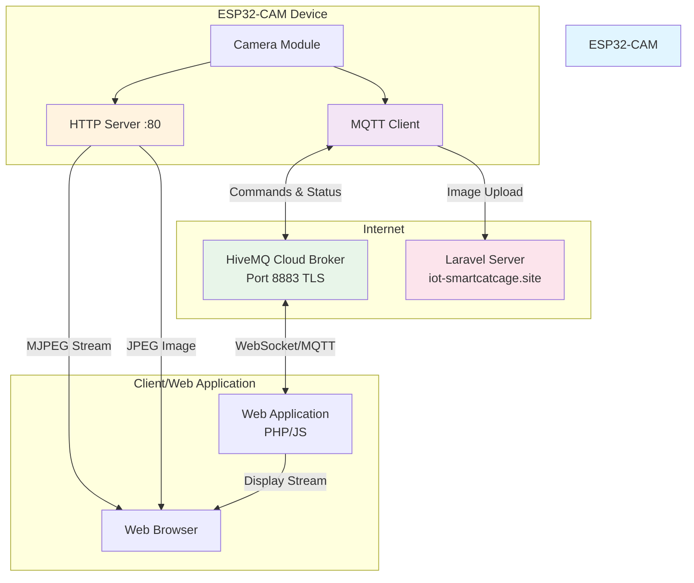
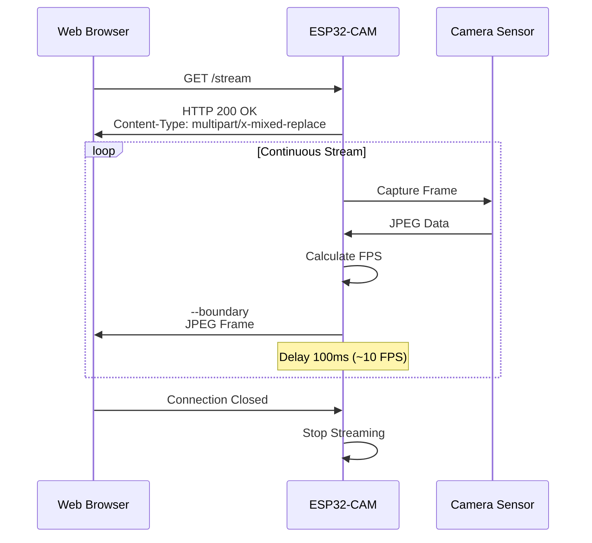
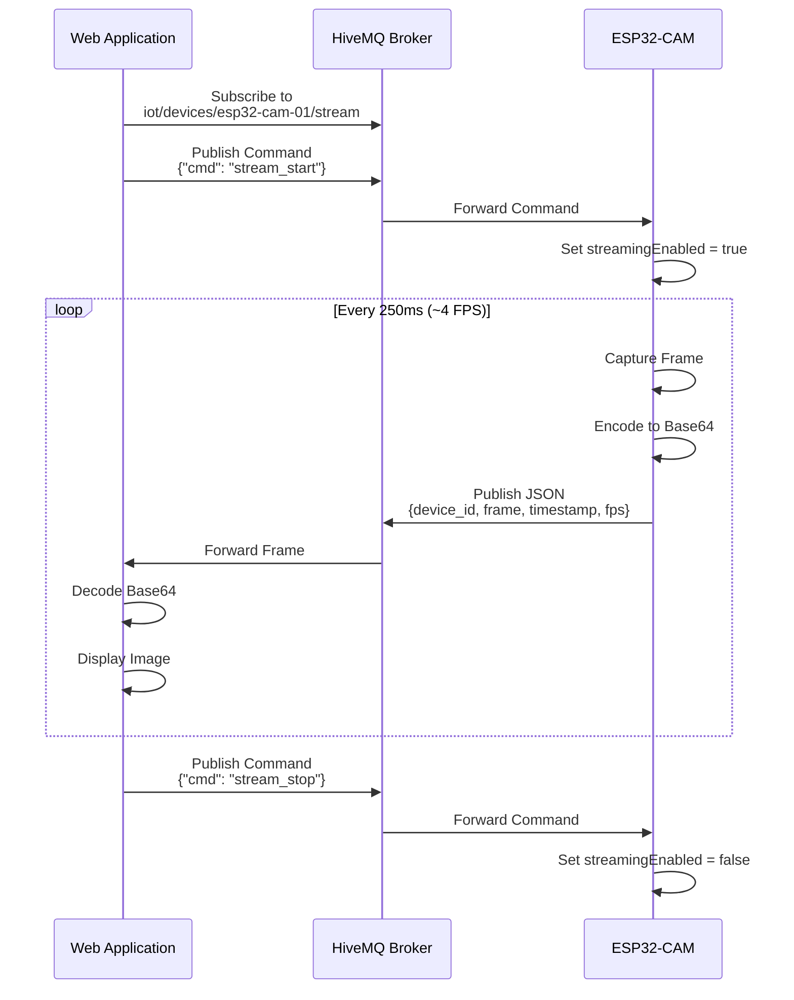
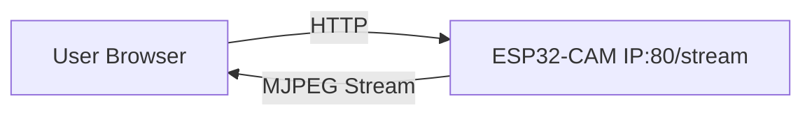
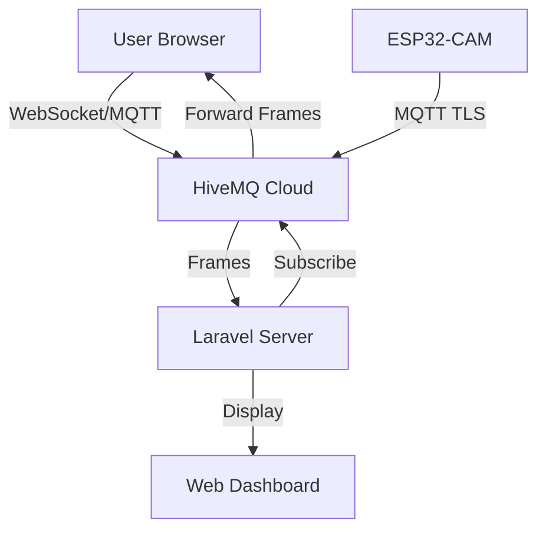
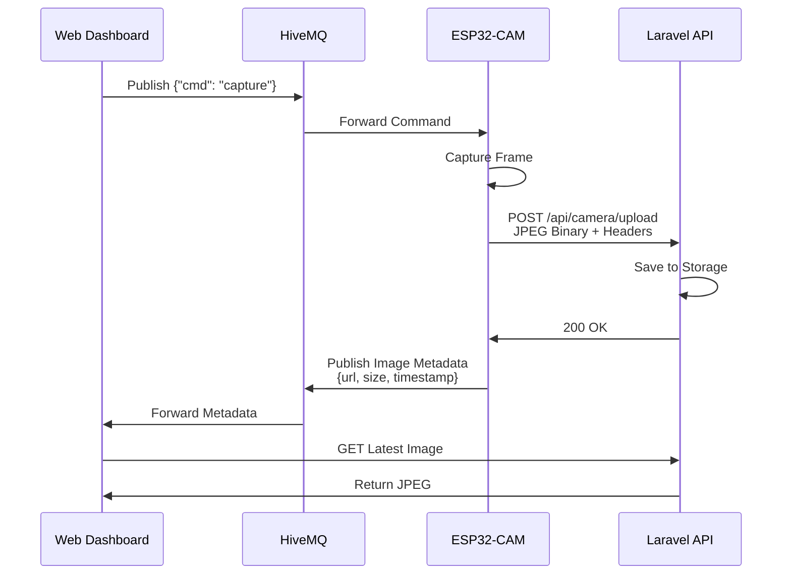

# Dokumentasi Streaming ESP32-CAM ke Web Hosting

## 📋 Daftar Isi

- [Ringkasan Sistem](#ringkasan-sistem)
- [Arsitektur Hybrid](#arsitektur-hybrid)
- [Cara Kerja Streaming](#cara-kerja-streaming)
- [Protokol Komunikasi](#protokol-komunikasi)
- [Endpoint HTTP](#endpoint-http)
- [MQTT Topics](#mqtt-topics)
- [Alur Kerja Streaming](#alur-kerja-streaming)
- [Integrasi dengan Web Hosting](#integrasi-dengan-web-hosting)
- [Konfigurasi](#konfigurasi)
- [Troubleshooting](#troubleshooting)

---

## 🎯 Ringkasan Sistem

ESP32-CAM ini menggunakan **Arsitektur Hybrid** yang menggabungkan:

- **HTTP Server** untuk akses langsung (streaming, capture, status)
- **MQTT Client** untuk kontrol jarak jauh dan metadata

### Tujuan Utama

- **Real-time Video Streaming** melalui HTTP
- **Remote Control** melalui MQTT
- **Image Upload** ke Laravel Server
- **Status Monitoring** via MQTT

---

## 🏗️ Arsitektur Hybrid



---

## 🎥 Cara Kerja Streaming

### 1. **MJPEG Streaming (HTTP Direct)**

ESP32-CAM menyediakan endpoint `/stream` yang menghasilkan **Motion JPEG (MJPEG)** stream.

#### Teknologi:

- **Protocol**: HTTP/1.1
- **Content-Type**: `multipart/x-mixed-replace`
- **Format**: JPEG frames

#### Proses Streaming:



#### Kode Implementasi (`stream_handler`):

```cpp
static esp_err_t stream_handler(httpd_req_t *req) {
  camera_fb_t *fb = NULL;
  httpd_resp_set_type(req, _STREAM_CONTENT_TYPE);

  while (true) {
    // 1. Capture frame dari kamera
    fb = esp_camera_fb_get();
    if (!fb) break;

    // 2. Hitung FPS
    uint64_t now = esp_timer_get_time();
    float dt = (now - g_last_frame_time) / 1000000.0f;
    if (dt > 0.0f) {
      float inst_fps = 1.0f / dt;
      g_fps = g_fps * 0.8f + inst_fps * 0.2f; // Smoothing
    }
    g_last_frame_time = now;

    // 3. Kirim boundary dan header
    httpd_resp_send_chunk(req, _STREAM_BOUNDARY, ...);
    httpd_resp_send_chunk(req, part_buf, hlen);

    // 4. Kirim JPEG data
    httpd_resp_send_chunk(req, (const char *)fb->buf, fb->len);

    // 5. Return frame buffer
    esp_camera_fb_return(fb);

    // 6. Delay untuk limit FPS (~10 FPS)
    vTaskDelay(100 / portTICK_PERIOD_MS);
  }
  return ESP_OK;
}
```

#### Format Data Stream:

```
HTTP/1.1 200 OK
Content-Type: multipart/x-mixed-replace;boundary=123456789000000000000987654321

--123456789000000000000987654321
Content-Type: image/jpeg
Content-Length: 15234

[JPEG BINARY DATA FRAME 1]
--123456789000000000000987654321
Content-Type: image/jpeg
Content-Length: 15421

[JPEG BINARY DATA FRAME 2]
--123456789000000000000987654321
...
```

---

### 2. **MQTT-Based Streaming (WebSocket)**

Untuk streaming jarak jauh melalui web hosting, digunakan MQTT dengan encoding base64.

#### Alur Kerja:



#### Kode Implementasi (Loop):

```cpp
if (streamingEnabled) {
  static unsigned long lastStreamCapture = 0;
  const unsigned long STREAM_INTERVAL_MS = 250;  // ~4 FPS

  if (now - lastStreamCapture >= STREAM_INTERVAL_MS) {
    camera_fb_t *fb = esp_camera_fb_get();
    if (fb) {
      // 1. Encode frame to base64
      String base64Frame = base64::encode(fb->buf, fb->len);

      // 2. Create JSON payload
      StaticJsonDocument<512> streamDoc;
      streamDoc["device_id"] = DEVICE_ID;
      streamDoc["frame"] = base64Frame;  // base64 JPEG
      streamDoc["timestamp"] = millis();
      streamDoc["fps"] = g_fps;
      streamDoc["size"] = fb->len;

      String streamPayload;
      serializeJson(streamDoc, streamPayload);

      // 3. Publish to MQTT stream topic
      mqttClient.publish(TOPIC_STREAM.c_str(), streamPayload.c_str());

      esp_camera_fb_return(fb);
    }
    lastStreamCapture = now;
  }
}
```

#### Format Payload MQTT Stream:

```json
{
  "device_id": "esp32-cam-01",
  "frame": "/9j/4AAQSkZJRgABAQEAYABgAAD...",
  "timestamp": 123456,
  "fps": 8.5,
  "size": 15234
}
```

---

## 📡 Protokol Komunikasi

### HTTP Server (Port 80)

| Endpoint   | Method | Deskripsi                               | Response                    |
| ---------- | ------ | --------------------------------------- | --------------------------- |
| `/stream`  | GET    | MJPEG streaming kontinyu                | `multipart/x-mixed-replace` |
| `/capture` | GET    | Capture single frame                    | `image/jpeg`                |
| `/status`  | GET    | Status kamera (framesize, quality, fps) | `application/json`          |
| `/control` | GET    | Set parameter kamera                    | `application/json`          |

#### Contoh Request `/control`:

```
GET /control?var=flash&val=1
GET /control?var=quality&val=10
GET /control?var=framesize&val=7
```

---

### MQTT Topics

| Topic                               | Arah      | Deskripsi                      | Format |
| ----------------------------------- | --------- | ------------------------------ | ------ |
| `iot/devices/esp32-cam-01/status`   | Publish   | Heartbeat status device        | JSON   |
| `iot/devices/esp32-cam-01/image`    | Publish   | Metadata image setelah capture | JSON   |
| `iot/devices/esp32-cam-01/commands` | Subscribe | Terima remote commands         | JSON   |
| `iot/devices/esp32-cam-01/stream`   | Publish   | Base64 JPEG frames             | JSON   |

#### Commands yang Didukung:

```json
// Capture dan upload ke Laravel
{"cmd": "capture"}

// Start/Stop streaming via MQTT
{"cmd": "stream_start"}
{"cmd": "stream_stop"}

// Flash LED control
{"cmd": "flash_on"}
{"cmd": "flash_off"}

// Set camera quality (0-63, lower is better)
{"cmd": "set_quality", "params": {"quality": 10}}

// Set resolution
{"cmd": "set_resolution", "params": {"resolution": "VGA"}}
// Options: UXGA, SXGA, XGA, SVGA, VGA, QVGA
```

---

## 🌐 Integrasi dengan Web Hosting

### Skenario 1: Akses Langsung (Local Network)



**Cara Akses:**

```html
<!-- Di web hosting (HTML/PHP) -->

```

> ⚠️ **Limitasi**: Hanya bisa diakses dalam jaringan lokal yang sama.

---

### Skenario 2: Remote Access via MQTT + WebSocket



#### Implementasi di Web (JavaScript):

```javascript
// 1. Connect to MQTT Broker via WebSocket
const client = mqtt.connect(
  "wss://3ccfdf64ce1f497db3a40c9b37fe1624.s1.eu.hivemq.cloud:8884/mqtt",
  {
    username: "mizaell",
    password: "Miegoreng1-",
    clientId: "web-client-" + Math.random().toString(16).substr(2, 8),
  }
);

// 2. Subscribe to stream topic
client.on("connect", function () {
  client.subscribe("iot/devices/esp32-cam-01/stream");

  // Send start stream command
  client.publish(
    "iot/devices/esp32-cam-01/commands",
    JSON.stringify({ cmd: "stream_start" })
  );
});

// 3. Receive and display frames
client.on("message", function (topic, message) {
  const data = JSON.parse(message.toString());

  // Decode base64 frame
  const imgElement = document.getElementById("live-stream");
  imgElement.src = "data:image/jpeg;base64," + data.frame;

  // Update FPS display
  document.getElementById("fps").textContent = data.fps.toFixed(1);
});
```

#### Implementasi di Laravel (PHP):

```php
// Backend subscriber untuk menerima frames
use PhpMqtt\Client\MqttClient;

$mqtt = new MqttClient($broker, $port, $clientId);
$mqtt->connect($username, $password, true);

$mqtt->subscribe('iot/devices/esp32-cam-01/stream', function ($topic, $message) {
    $data = json_decode($message, true);

    // Simpan latest frame ke cache/database
    Cache::put('latest_frame_esp32-cam-01', $data['frame'], 60);

    // Broadcast ke WebSocket clients (Laravel Echo)
    broadcast(new CameraFrameReceived([
        'device_id' => $data['device_id'],
        'frame' => $data['frame'],
        'timestamp' => $data['timestamp']
    ]));
}, 0);

$mqtt->loop(true);
```

---

### Skenario 3: Image Upload ke Laravel

Untuk snapshot (bukan streaming), ESP32 upload image langsung ke Laravel:



#### ESP32 Upload Code:

```cpp
bool uploadImageToLaravel(camera_fb_t *fb) {
  WiFiClientSecure client;
  client.setInsecure();

  HTTPClient http;
  http.begin(client, LARAVEL_SERVER_URL);
  http.addHeader("Content-Type", "image/jpeg");
  http.addHeader("X-Device-ID", DEVICE_ID);
  http.addHeader("X-API-KEY", LARAVEL_API_KEY);

  int httpCode = http.POST(fb->buf, fb->len);

  if (httpCode == 200 || httpCode == 201) {
    return true;
  }
  return false;
}
```

#### Laravel API Endpoint:

```php
// routes/api.php
Route::post('/camera/upload', [CameraController::class, 'upload']);

// app/Http/Controllers/CameraController.php
public function upload(Request $request)
{
    $deviceId = $request->header('X-Device-ID');
    $apiKey = $request->header('X-API-KEY');

    // Validate API Key
    if ($apiKey !== config('app.camera_api_key')) {
        return response()->json(['error' => 'Unauthorized'], 401);
    }

    // Save image
    $imageData = $request->getContent();
    $filename = $deviceId . '_' . time() . '.jpg';
    Storage::disk('public')->put('camera/' . $filename, $imageData);

    // Save to database
    CameraImage::create([
        'device_id' => $deviceId,
        'filename' => $filename,
        'size' => strlen($imageData),
        'captured_at' => now()
    ]);

    return response()->json([
        'success' => true,
        'url' => Storage::url('camera/' . $filename)
    ]);
}
```

---

## ⚙️ Konfigurasi

### ESP32-CAM Configuration

```cpp
// WiFi
const char *WIFI_SSID = "Ell";
const char *WIFI_PASS = "Mizaell14-";

// MQTT Broker (HiveMQ Cloud)
const char *MQTT_BROKER = "3ccfdf64ce1f497db3a40c9b37fe1624.s1.eu.hivemq.cloud";
const int MQTT_PORT = 8883;  // TLS
const char *MQTT_USERNAME = "mizaell";
const char *MQTT_PASSWORD = "Miegoreng1-";
const char *DEVICE_ID = "esp32-cam-01";

// Laravel Server
const char *LARAVEL_SERVER_URL = "https://iot-smartcatcage.site/api/camera/upload";
const char *LARAVEL_API_KEY = "supersecretkey123";

// Camera Settings
config.frame_size = FRAMESIZE_QVGA;  // 320x240
config.jpeg_quality = 12;            // 0-63 (lower = better)
config.fb_count = 2;                 // Frame buffers
```

### Pinout AI-Thinker ESP32-CAM

```
PWDN_GPIO_NUM    = 32
RESET_GPIO_NUM   = -1 (not used)
XCLK_GPIO_NUM    = 0
SIOD_GPIO_NUM    = 26
SIOC_GPIO_NUM    = 27

Y9_GPIO_NUM      = 35
Y8_GPIO_NUM      = 34
Y7_GPIO_NUM      = 39
Y6_GPIO_NUM      = 36
Y5_GPIO_NUM      = 21
Y4_GPIO_NUM      = 19
Y3_GPIO_NUM      = 18
Y2_GPIO_NUM      = 5

VSYNC_GPIO_NUM   = 25
HREF_GPIO_NUM    = 23
PCLK_GPIO_NUM    = 22
FLASH_LED_PIN    = 4
```

---

## 🔧 Troubleshooting

### Problem: Stream tidak muncul di web

**Solusi:**

1. Pastikan ESP32 dan client di jaringan yang sama (untuk HTTP direct)
2. Cek IP address ESP32 di Serial Monitor
3. Test akses langsung: `http://<ESP32_IP>/stream`
4. Periksa firewall

### Problem: MQTT tidak terhubung

**Solusi:**

```cpp
// Debug MQTT connection
Serial.printf("MQTT State: %d\n", mqttClient.state());
// -4 : Connection timeout
// -3 : Connection lost
// -2 : Connect failed
// -1 : Disconnected
//  0 : Connected
```

### Problem: Upload ke Laravel gagal

**Solusi:**

1. Cek koneksi internet ESP32
2. Verify Laravel API endpoint: `curl https://iot-smartcatcage.site/api/camera/upload`
3. Periksa API Key di request header
4. Tingkatkan timeout: `http.setTimeout(30000);`

### Problem: FPS rendah

**Solusi:**

```cpp
// 1. Turunkan resolusi
s->set_framesize(s, FRAMESIZE_QVGA);

// 2. Turunkan quality (angka lebih besar = kompresi lebih tinggi)
s->set_quality(s, 20);

// 3. Kurangi stream delay
vTaskDelay(50 / portTICK_PERIOD_MS);  // ~20 FPS
```

---

## 📊 Performance Metrics

| Resolusi       | Quality | Frame Size | FPS (HTTP) | FPS (MQTT) |
| -------------- | ------- | ---------- | ---------- | ---------- |
| QVGA (320x240) | 12      | ~15 KB     | 10         | 4          |
| VGA (640x480)  | 12      | ~35 KB     | 8          | 2          |
| SVGA (800x600) | 12      | ~50 KB     | 5          | 1          |
| XGA (1024x768) | 12      | ~80 KB     | 3          | -          |

> ⚠️ MQTT streaming dibatasi FPS lebih rendah karena overhead base64 encoding dan bandwidth broker.

---

## 🚀 Best Practices

### 1. Gunakan HTTP untuk Local Streaming

- **Latency rendah** (~100ms)
- **FPS tinggi** (up to 15 FPS)
- **Bandwidth efisien** (no encoding overhead)

### 2. Gunakan MQTT untuk Remote Control

- **Reliable delivery** (QoS 1)
- **Bi-directional** (commands + status)
- **Cloud-friendly** (firewall-safe)

### 3. Gunakan Upload untuk Snapshots

- **Persistent storage**
- **No client connection required**
- **History tracking**

### 4. Security Recommendations

```cpp
// ✅ DO: Use TLS/SSL
wifiSecureClient.setInsecure();  // Development
wifiSecureClient.setCACert(root_ca);  // Production

// ✅ DO: Strong passwords
const char *MQTT_PASSWORD = "ComplexP@ssw0rd!23";

// ✅ DO: API Key validation
http.addHeader("X-API-KEY", LARAVEL_API_KEY);

// ❌ DON'T: Hardcode credentials in public repos
// Use environment variables or secure storage
```

---

## 📝 Rangkuman

### Cara Kerja Streaming ESP32-CAM ↔ Web Hosting:

1. **Local Network (HTTP)**

   - ESP32 runs HTTP server on port 80
   - Browser requests `/stream` endpoint
   - ESP32 sends MJPEG stream (JPEG frames with boundaries)
   - Real-time display dengan latency minimal

2. **Remote Network (MQTT)**

   - ESP32 connects to HiveMQ Cloud (MQTT Broker)
   - Web application subscribes to stream topic via WebSocket
   - ESP32 publishes base64-encoded JPEG frames
   - Web decodes and displays frames

3. **Hybrid Approach**
   - HTTP untuk streaming performance tinggi (local)
   - MQTT untuk remote control dan monitoring
   - Laravel API untuk image storage dan history

---

**Dibuat oleh**: ESP32-CAM IoT Integration Team  
**Tanggal**: 23 Desember 2025  
**Device ID**: esp32-cam-01  
**Server**: iot-smartcatcage.site
